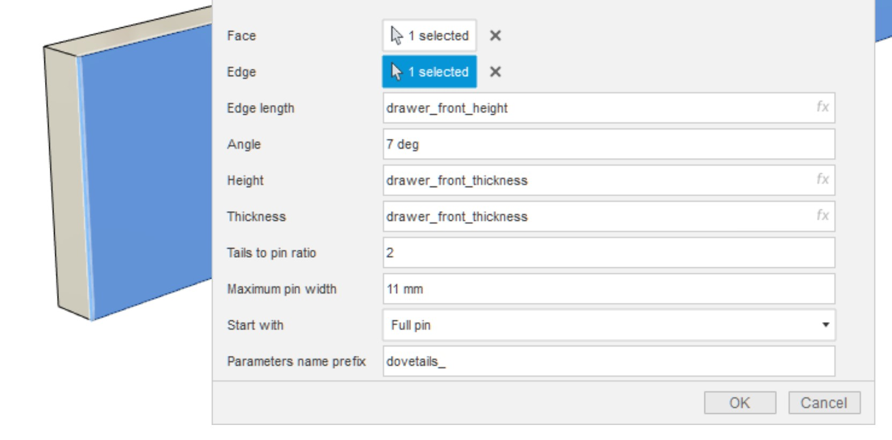
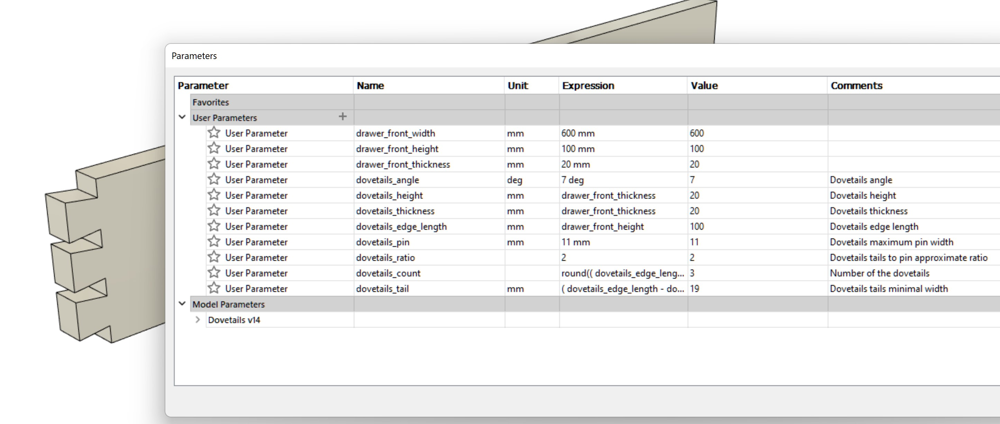
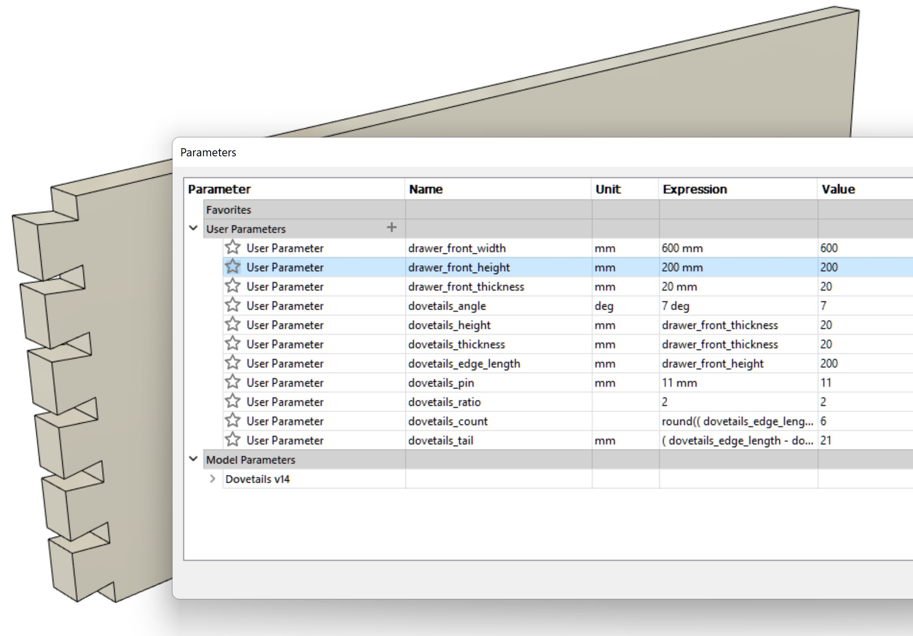
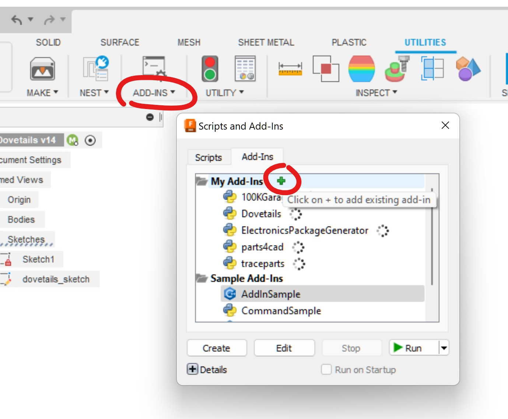

# FusionDovetails
This is Fusion 360 plugin that creates "tails" part of the dovetail woodworking joint on the specified edge.

Plugin generates parametric sketch and bodies and creates user parameters for them. This allows not only to change those parameter afterward and get "tails" recalculated, but also allowing to specify other parameters instead of constant values when creating tails and get automatically recalculated dovetails when parameters of the board changes.

# Insallation
Clone or download and add the directory via addins dialog

# Limitations
This plugin was designed and tested on simple rectangle boards so it's possible it won't work correctly on more complex shapes. 
